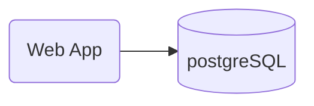
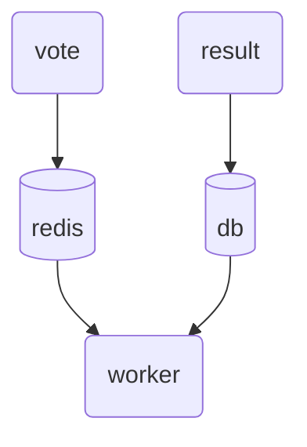
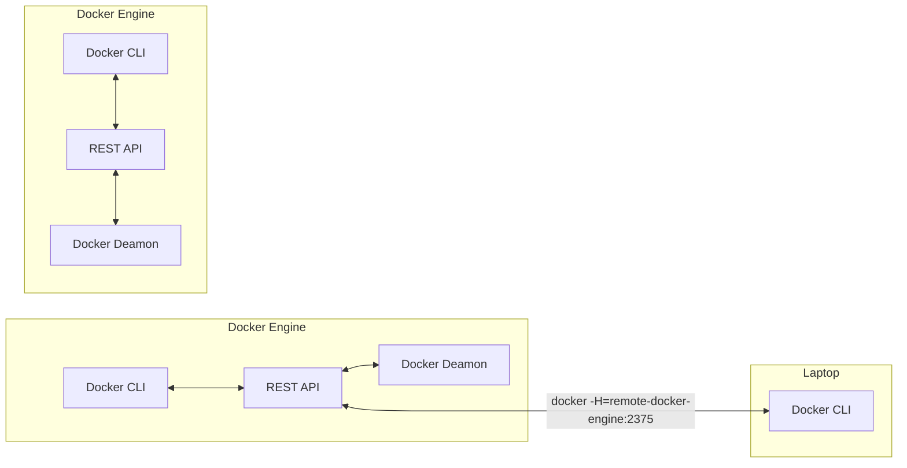
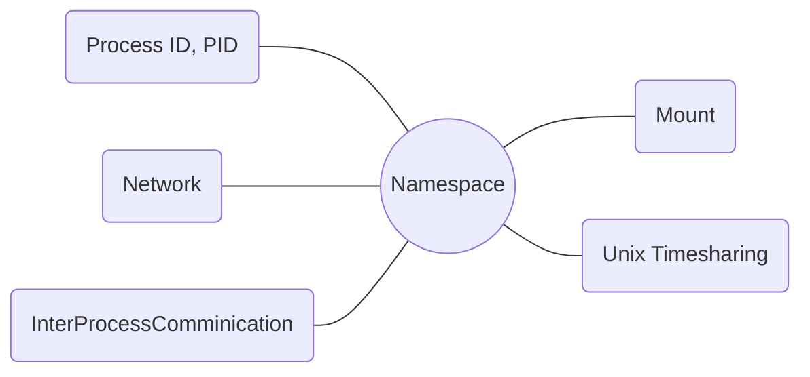
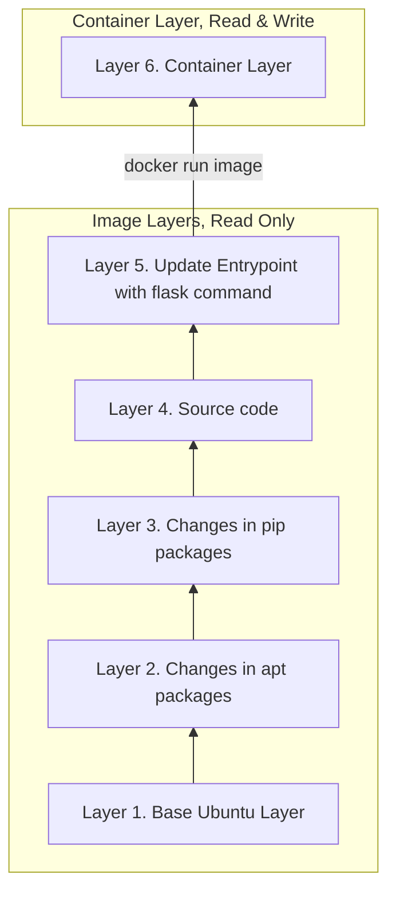
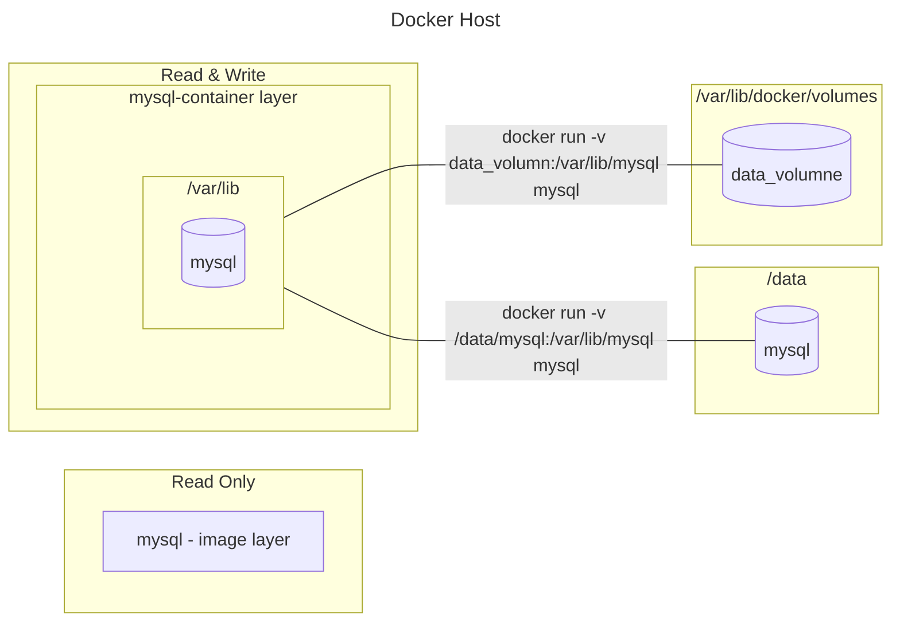
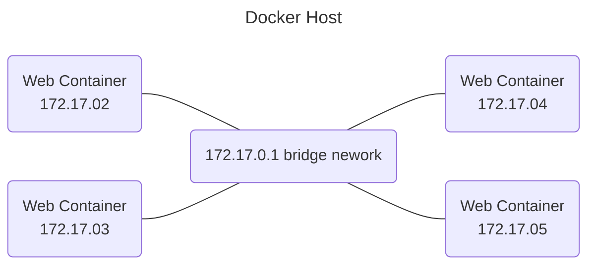
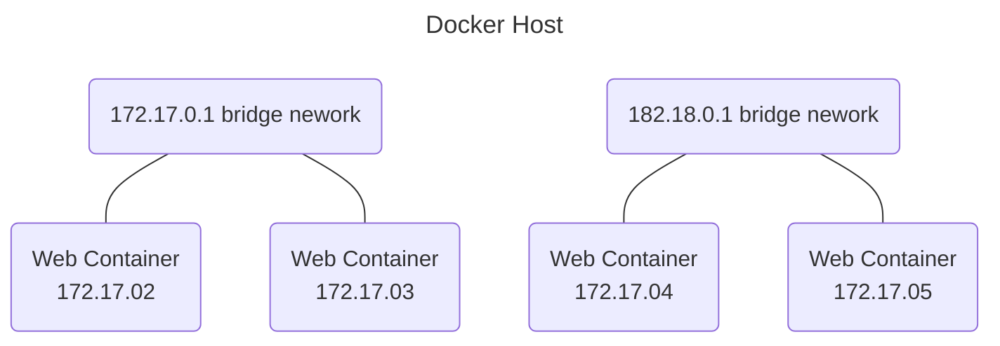

[TOC]


# Docker

## 基础概念

为什么需要docker

开发人员的操作系统不一致，无法保证构建的应用程序在不同的环境中以相同的额方式运行。造成开发，构建和发布应用程序变得苦难。因此需要解决兼容性问题的工具。

使用docker可以只需要根据配置创建好docker。开发人员可以不用考虑自己的操作系统。都可以在同一个环境上开发。


虚拟机和容器的区别

docker的主要用途是打包和容器化应有程序并发送给其它地方。


#### Image

**镜像(Image)**: 镜像是由文件系统和参数组成的只读模板，用于创建Docker容器。镜像通常包含一个预配置的应用程序及其依赖项。可以将它看作是创建和运行容器的“蓝图”。

> 例如，一个镜像可能包含一个已经安装和配置好的Web服务器和你的Web应用程序，或者包含一个预配置的数据库服务器等。

aasddasdasdasd

镜像的重要特性：

- 分层和轻量级：Docker镜像是分层的，每一层都只包含上一层的更改。这使得镜像体积小，提高了创建和分发镜像的效率。同时，多个容器可以共享相同的镜像，使资源使用更高效。

- 可移植性：由于Docker镜像包含应用程序和所有它的依赖项，因此可以在不同的环境（开发、测试、生产）中保持一致性和可移植性。

- 版本控制和可复用性：Docker镜像支持版本控制，可以轻松地回滚到之前的版本。同时，你可以基于现有镜像创建新的镜像，例如，在现有的Ubuntu镜像上添加应用程序，形成一个新的镜像。

- 易于创建和更新：创建Docker镜像很简单，可以从头开始，或者基于其他人的镜像。镜像一旦被创建，可以轻松地更新和改进，然后再发布出去。

镜像是存储在Docker Registry（如Docker Hub）中的，用户可以从这些Registry拉取（pull）镜像来创建新的容器，也可以推送（push）他们创建或修改的镜像到Registry以供他人使用。


#### Container

**容器(Container)**: 容器(Container)是镜像（Image）运行时的实例。简单来说，如果将镜像看作一个程序的只读模板，那么容器就是该程序运行时的进程。根据容器的主要特性，容器可以被视为轻量级的、可以包含和运行应用程序及其所有依赖项的独立空间，非常适合微服务架构和DevOps实践。

容器在操作系统级别虚拟化，与其他容器共享同一台宿主机的操作系统，但在文件系统、用户空间和网络等方面互相隔离。每个容器内部运行着一个完整的用户空间，这就是为什么可以在一个容器中运行Ubuntu，而在另一个容器中运行CentOS。

> 也可以理解容器是完全隔离的环境。像虚拟机一样，可以有自己的进程或服务，自己的网络接口。只是都共享同一个操作系统内核。它是独立的镜像的运行实例，有自己的环境和一组流程。
>
> 
>
> 容器并不意味着承载操作系统，容器意味着运行特定的任务或进程。例如托管web服务器或应用服务器或数据库的实例或者只承载某种计算或分析任务，任务完成后，容器将推出。容器仅在其内部的进程处于活动状态时菜存在。如果容器内的web服务停止或者崩溃，则容器将推出。


容器的主要特性：

- 轻量级和快速：与传统的虚拟机相比，Docker容器非常轻量，启动几乎是瞬间完成的，因为它们与宿主操作系统共享内核，但没有运行整个操作系统。

- 模块化和可扩展：每个容器都应只包含一项服务。

	> 例如，如果有一个应用程序，其中包含一个Web服务器和一个数据库，应该在两个独立的容器中运行它们。容器可以通过网络彼此通信，并且可以在运行时动态添加或删除。

- 可移植：由于容器包含它们的依赖项，它们可以在任何安装了Docker的系统上运行，而不考虑底层环境的差异。这使得在不同环境（开发、测试、生产）之间移动应用程序变得非常简单。

- 版本控制和共享：Docker容器可以从Docker镜像创建，镜像可以版本控制和共享。这使得可以轻松地分发应用程序，并且有能力快速回滚到之前的版本。

- 隔离：每个容器都在自己的环境中运行，并且有自己的网络接口、文件系统和进程空间，因此它们在网络、存储和CPU资源等方面与其他容器隔离。


#### Repository

**仓库(Repository)**：容器的仓库（Repository），通常是指一个集中存储和分发 Docker 镜像的地方。这些 Docker 镜像被用来创建 Docker 容器。


Docker 镜像仓库分为两种类型：

- 公共仓库（Public Repository）：公共仓库可以被所有人访问和使用。Docker Hub 是最著名的公共 Docker 仓库，它存储了大量的 Docker 镜像，用户可以从中拉取或者推送镜像。公共仓库中包含了许多由社区成员创建的镜像，也包括一些官方维护的镜像，例如 Ubuntu、Node.js、MySQL 等。

- 私有仓库（Private Repository）：私有仓库只能由特定的用户或组织访问。可以在 Docker Hub 上创建私有仓库，也可以使用一些第三方的服务，如 AWS 的 ECR（Elastic Container Registry）、Google 的 GCR（Google Container Registry）等。此外，也可以在自己的服务器上部署私有 Docker 仓库，如使用 Docker 提供的 Docker Registry 软件。

无论是公共仓库还是私有仓库，都支持镜像的版本管理和分发，用户可以拉取（pull）仓库中的镜像创建新的容器，也可以将自己创建或修改的镜像推送（push）到仓库中以供他人使用。


#### 三者的关系


## Docker Commands

### syntax

Docker 的基本命令行语法格式如下：

```bash
docker [option] [command] [arguments]
```

- **option**：这部分是 Docker 命令的全局选项，例如 --help。
- **command**：这部分是 Docker 提供的各种命令，例如 run, ps, pull, push 等。
- **arguments**：这部分是命令的参数或操作对象，例如一个镜像名或容器 ID。


### run

run是Docker 的一个核心命令，用于从 Docker 镜像创建一个新的容器，并启动该容器。当使用 docker run 命令时，Docker 会进行以下操作：

1. 如果本地不存在所指定的镜像，Docker 会从 Docker Hub 或其他配置的 Docker 镜像仓库中拉取镜像。
2. Docker 使用这个镜像创建一个新的容器。
3. Docker 启动这个新创建的容器，并运行指定的命令。

```bash
docker run [OPTIONS] IMAGE[:TAG|@DIGEST] [COMMAND] [ARG...]
```

- **OPTIONS**：命令选项，如 -d（在后台运行）、-p（映射端口）、-v（挂载卷）等。
	- **-d, --detach**：以分离模式运行容器（即在后台运行）。
	- **-e, --env**：设置环境变量。
	- **-i, --interactive**：即使没有附加也保持 STDIN 打开。
	- **-t, --tty**：分配一个伪终端，通常与 -i 一起使用，即 docker run -it。
	- **-p, --publish**：发布容器的一个网络端口到主机，通常用于端口映射，如 -p 8080:80，将容器的80端口映射到主机的8080端口。
	- **-v, --volume**：挂载卷，用于文件或目录的共享和持久化。
	- **--name**：指定容器的名字。
	- **--rm**：容器退出后自动删除容器。
	- **-P, --publish-all**：发布所有容器的端口到主机。
- **IMAGE**：要运行的 Docker 镜像的名字。
- **TAG 或 DIGEST（可选）**：用于指定镜像的版本。如果不指定，Docker 默认使用 latest 标签。
- **COMMAND（可选）**：在容器中要运行的命令。如果不指定，Docker 会运行镜像 Dockerfile 中指定的默认命令。
- **ARG（可选）**：传递给 COMMAND 的参数。


```bash
# : 后边的就是tag
docker run redis:4.0

# 使用image_name作为镜像创建容器，将容器命名为app_name，并在后台运行这个容器。
docker run -d --name app_name image_name

# 将容器的5000端口映射到host80端口
docker run -p 80:5000 test/webapp
```


### stop

该命令用于停止一个或多个正在运行的 Docker 容器。当停止一个容器时，它会触发容器内部的停止信号，然后容器会按照预定义的规则进行清理和关闭。命令语法为

```bash
docker stop [OPTIONS] CONTAINER [CONTAINER...]
```

常见的参数包括：

- **CONTAINER**：要停止的容器的名称或 ID。

常见的选项包括：

- **--time, -t**：指定停止容器的等待时间（以秒为单位）。如果容器在指定的时间内没有停止，Docker 将强制终止它。
- **--time=10**：设置停止等待时间为 10 秒。
- **--signal, -s**：指定要发送给容器的停止信号。默认情况下，Docker 会发送 SIGTERM 信号，然后等待一段时间再发送 SIGKILL 信号。
- `--signal=SIGTERM`：设置停止信号为 SIGTERM。

```bash
# 停止名为my_container的容器
docker stop my_container

# 在3秒后停止名为my_container的容器
docker stop --time 3 my_container

# 使用 SIGINT 信号停止容器 "my-container"
docker stop --signal=SIGINT my-container
```


### ps

该命令用于列出当前正在运行的 Docker 容器。允许你查看容器的基本信息，如容器 ID、名称、使用的镜像、运行状态等等。可以帮助你监视容器的状态以及了解正在运行的容器情况。ps的全称是 process status。

```bash
docker ps [OPTIONS]
```

常见的参数包括：

- **-a, --all**：显示所有的容器，包括没有运行的。
- **-q, --quie**t：只显示容器的编号。
- **-n**：显示最后创建的n个容器。
- **--no-trunc**：不截断输出。
- **-s, --size**：显示总的文件大小。
- **-f, --filter** ：过滤输出。
- **--latest, -l**：显示最近创建的容器。
- **--format**：指定输出格式，可以使用 Go 模板语法定义格式。

可以组合参数使用，比如 `docker ps -aq`

```bash
# 列出所有正在运行的容器和基本信息
docker ps

# 按创建时间显示容器（最近的在最前）
docker ps --latest

# 显示最后创建的 5 个容器
docker ps -n 5

# 只显示正在运行的容器。
docker ps -f "status=running"

 # 只显示容器的 ID
docker ps -q

# 指定输出格式
docker ps --format "{{.ID}}\t{{.Names}}"

# 显示最近创建的容器
docker ps -l
```


### inspect

用于获取有关Docker对象（如镜像、容器、网络或卷）的详细信息。这个命令通过名称或者ID去指定想要检查的对象, 返回的信息以JSON格式给出，其中包含了关于该对象的所有详细信息.

```bash
docker inspect [OPTIONS] NAME|ID [NAME|ID...]
```

常见的参数包括：

- **NAME|ID**：要获取详细信息的 Docker 对象的名称或 ID。

常见的选项包括

- **--format , -f**: 使用Go模板语言格式化输出结果。

- **--size , -s**: 仅用于容器，显示容器文件系统的总大小。

- **--type**: 指定要检查的对象的类型。有效的类型包括：container、image、volume、network、service、node、task或者plugin。

```bash
docker inspect [options] name|id [name|id...]

# 如果只想查看容器的IP地址
docker inspect --format '{{ .NetworkSettings.IPAddress }}' container_name_or_id。
```


### rm

用于删除一个或多个 Docker 容器。需要注意的是，此命令只能删除已停止的容器。如果想要删除正在运行的容器，需要先停止容器，或者使用 docker rm -f 命令来强制删除容器

```bash
docker rm [OPTIONS] CONTAINER [CONTAINER...]
```

常见的参数包括：

- **CONTAINER**：要删除的一个或多个容器的名称或 ID。

常见的选项包括：

- **-f, --force**：强制删除一个正在运行的容器。
- **-v, --volumes**：同时删除容器挂载的卷。
- **--link**：删除与其他容器链接的链接（仅在网络模式设置为 "link" 时有效）。

```bash
docker rm [OPTIONS] CONTAINER [CONTAINER...]

# container id 为abc123 也可以使用container name
docker rm abc123

# 假设存在正在运行的容器
docker stop $(docker ps -aq)

# 删除所有已经停止的容器
docker rm $(docker ps -aq)
```


### rmi

用于删除一个或多个 Docker 镜像。需要通过image的短 ID，长 ID，标签或者摘要来指定要删除的镜像。可以一次删除多个镜像，只需要在命令后面添加多个镜像的 ID 或者标签即可。注意如果一个 Docker 镜像被一个或多个容器使用，那么默认情况下 docker rmi 命令将无法删除该镜像，除非使用 -f 或 --force 参数来强制删除。

```bash
docker rmi [OPTIONS] IMAGE [IMAGE...]
```

常见的参数包括：

- **IMAGE**：要删除的一个或多个镜像的名称或 ID。

常见的选项包括：

- **-f, --force**：强制删除，即使有停止的容器使用该镜像。
- **--no-prune**：不移除未标记的父镜像。

```bash
docker rmi [OPTIONS] IMAGE [IMAGE...]

# 名为 my_image 的 Docker 镜像
docker rmi my_image

# 强制删除 my_image 的 Docker 镜像
docker rmi -f my_image

# 删除所有image
docker rmi $(docker images -aq)
```


### logs

该命令用于获取容器的日志输出。允许查看容器内部产生的标准输出（stdout）和标准错误（stderr）的日志内容，以便进行故障排查、监视和诊断。基本的使用格式为：

```bash
docker logs [OPTIONS] CONTAINER
```

常见的参数包括：

- `CONTAINER`：要获取日志的容器的名称或 ID。

常见的选项包括：

- `-f, --follow`：实时跟踪日志的输出，类似于 `tail -f` 命令。
- `--tail`：指定要显示的最新的日志行数。
- `--since`：只显示从指定时间之后产生的日志。
- `--until`：只显示在指定时间之前产生的日志。

```bash
# 获取容器 "my-container" 的日志
docker logs my-container 

# 实时跟踪容器 "my-container" 的日志
docker logs -f my-container

# 获取容器 "my-container" 的最后 100 行日志
docker logs --tail 100 my-container

# 获取容器 "my-container" 从 2023-01-01 之后的日志
docker logs --since "2023-01-01" my-container
```


### exec

docker exec 命令用于在正在运行的 Docker 容器中执行命令。通过这个命令，你可以在容器内部运行特定的命令，用于与容器交互、调试、管理等。

基本的使用格式为：

```bash
docker exec [OPTIONS] CONTAINER COMMAND [ARG...]
```


常见的参数和选项包括：

- **CONTAINER**：要在其中执行命令的容器的名称或 ID。
- **COMMAND**：要在容器内部执行的命令。

常见的选项包括：

- **-d, --detach**：在后台运行命令。
- **-i, --interactive**：保持输入流打开，以便与命令交互。
- **--user**：指定要执行命令的用户。
- **--workdir**：设置工作目录。
- **--env**：设置环境变量。
- **--privileged**：以特权模式运行命令。
- **--tty**：分配一个终端（tty）。

```bash
 # 在交互式终端中运行 bash 命令，进入容器 "my-container"
docker exec -it my-container bash

# 在容器 "my-container" 后台运行 ls 命令
docker exec -d my-container ls

# 在容器 "my-container" 中以 root 用户身份运行 whoami 命令
docker exec --user root my-container whoami  
```


### build

用于构建 Docker 镜像。通过执行 docker build 命令，可以根据一个 Dockerfile 构建一个镜像，Dockerfile 中包含了构建镜像所需的一系列指令。允许基于 Dockerfile 构建自定义的镜像，根据项目的需求添加所需的配置和依赖。基本用法：


```bash
docker build [OPTIONS] PATH | URL |
```


常用参数包括：

- **-t, --tag**：为镜像指定一个标签（tag），格式为 <name>:<tag>，用于标识构建的镜像。
- -**-build-arg**：设置构建时的构建参数，可以在 Dockerfile 中使用 ARG 指令引用。
- **--file, -f**：指定要使用的 Dockerfile 文件的路径。默认为当前目录下的 Dockerfile。
- **--no-cache**：禁用缓存，每一步都会重新执行，适用于确保重新构建镜像时不使用缓存。
- **--quiet, -q**：仅输出构建过程中的 ID，而不输出详细信息。
- **--pull**：总是尝试拉取最新的基础镜像。
- **--network**：指定构建时使用的网络配置，如 "host", "bridge" 等。
- **--force-rm**：在构建完成后移除临时容器。
- **--label**：为构建的镜像添加标签，格式为 key=value。
- **--target**：指定构建过程中的目标阶段，用于多阶段构建。


## Docker Images

### Create Images

Docker文件是以Docker可以理解的特定格式编写的文本文件｡它采用指令和参数格式｡例如, 在这个Docker文件中, 左边大写的所有内容都是一条指令。每个Docker映像都必须基于另一个映像, 该映像可以是操作系统, 也可以是之前基于操作系统创建的映像｡需要注意的是, 

- 所有Docker文件都必须以from指令开头｡
- 文件名字必须是Dockerfile

```dockerfile
FROM ubuntu

RUN apt-get update 
RUN apt-get install -y python3
RUN apt-get install -y python3-pip 
RUN pip install flask

COPY app.py /opt/app.py

ENTRYPOINT FLASK_APP=/opt/app.py flask run --host=0.0.0.0
```


### Environment Variables


利用docker run -e 可以更改代码中的环境变量

docker run -d -e ENV=env --name new_name image


### Command vs Entrypoint 

与虚拟机不同，容器并不是用来承载操作系统的。容器意味着运行特定的任务或进程, 例如托管Web服务器或应用程序服务器或数据库的实例,或者只是执行某种计算或分析任务｡任务完成后, 容器将退出｡容器只有在其内部的进程处于活动状态时才能提升｡

 

## Docker Compose

link&network

#### Link

**docker link** 是 Docker 引擎的一个旧功能，用于在不同容器之间建立连接和通信。它允许将一个容器连接到另一个容器，使它们能够通过容器名称直接进行网络通信，而无需显式暴露端口或使用 IP 地址。使用场景比如：一个webapp需要db持久化数据。因此需要两个container



```bash
docker run -d -p 8000:80 --link db:db result-app
docker run -d -e  POSTGRES_HOST_AUTH_METHOD=trust --name=db postgres:9.4
```


也可以使用docker-compose直接创建。而不需要单独执行命令行。以下是一个示例。参考

https://github.com/dockersamples/example-voting-app



以下是Docker Compose文件，它会根据配置文件启动定义的各个服务，它们可以在相互通信和协作的容器环境中运行 。`docker-compose up` 启动由 docker-compose.yml 文件定义的服务。

- 使用`docker-compose up` 前确认 docker-compose.yml文件所在目录上执行。


```yaml
redis:
  image: redis

db:
  image: postgres:9.4
  environment:
    POSTGRES_USERNAME: postgres
    POSTGRES_PASSWORD: postgres

vote:
  image: voting-app
  ports:
    - 8080:80
  links:
    - redis

worker:
  image: worker-app
  links:
    - db
    - redis

result:
  image: result-app
  ports:
    - 8000:80
  links:
    - db
```


#### Networking

另一种办法是使用services，它部分提供了一种简化、组织和管理多容器应用程序的方法，使得开发和部署变得更加方便和可控。它是 Docker Compose 的核心功能之一，有助于简化容器编排和应用程序的生命周期管理。

- 容器组织和管理： services 允许将相关的容器组织在一起，以创建一个多容器应用程序。这使得管理和协调不同的服务变得更加容易，尤其是在开发、测试和部署过程中。
- 易于配置和维护： 使用 services 部分，可以集中定义容器的配置，而不需要在每个容器中重复相同的设置（links的重复配置）。这使得配置更加一致和易于维护。
- 网络通信： services 部分使容器之间的通信变得容易。Docker Compose 会为每个服务创建一个网络，并允许服务之间使用容器名称进行通信，而不必直接使用 IP 地址。


```yaml
version: "3"
services:
  redis:
    image: redis
  
  db:
    image: postgres:9.4
    environment:
      POSTGRES_USERNAME: postgres
      POSTGRES_PASSWORD: postgres

  vote:
    image: voting-app
    ports:
      - 8080:80
  
  worker:
    image: worker-app
  
  result:
    image: result-app
    ports:
      - 8000:80
```


`docker-compose down --remove-orphans` 是一个 Docker Compose 命令，用于停止并移除由 `docker-compose.yml` 文件定义的服务，并且还会移除那些与已停止的服务没有关联的孤立容器（孤立容器是指未连接到任何服务的容器）。具体来说，该命令的作用是：

- 停止由 docker-compose.yml 文件定义的所有服务。
- 移除停止的服务的相关容器。
- 移除那些没有与任何服务关联的孤立容器（孤立容器是指未连接到任何服务的容器）


## Docker Registry

Docker Registry 是一个用于存储和分发 Docker 镜像的服务。它允许你将自己创建的 Docker 镜像上传到一个集中的存储位置，以便其他人或团队可以访问、下载和使用这些镜像。Docker 镜像仓库可以用来共享、管理和版本控制 Docker 镜像.

- Docker Hub Registry（默认）： Docker 官方提供的公共 Docker 镜像仓库

	当 `docker run image` 时，如果local没有相对应的image事时，它会从 docker.io/nginx/nginx pull下来image并run。以上的路径的意思是 [Registry/]User/Image[:Tag]。

	- Registry（仓库地址）：这是 Docker 镜像存储的地方，也称为镜像仓库。它指定了镜像从哪个地方下载。最常见的仓库是 Docker Hub（docker.io）。还有其他的镜像仓库，如果不指定仓库地址，默认使用 Docker Hub，docker.io. 
	- User（用户或组织）：在某些镜像仓库中，镜像可以按用户或组织进行组织。这部分指定了用户或组织的名称。例如，nginx 表示用户（或组织）是 Docker Hub 上的默认用户（或组织）。如果不提供user则认为image名和其是一致的。
	- Image（镜像名称）：这是具体的镜像名称，用于标识一个特定的容器镜像。例如，nginx、ubuntu 等。
	- Tag（标签）：这是镜像的版本标签。它指定了你想要的镜像版本。如果不指定标签，默认使用 latest。


- 私有 Docker Registry：除了 Docker Hub，还可以设置和使用Private Docker Registry。
	- 使用 `docker login private-registry.io` 命令登录到私有镜像仓库。需要提供相应的凭证，例如用户名和密码或者访问令牌
	- `docker run private-registry.io/apps/internal-app` 运行一个来自私有镜像仓库的镜像


docker run -d -p 5000:5000 --restart=always --name my-registry registry:2


```bash
Now its time to push some images to our registry server. Let's push two images for now .i.e. nginx:latest and httpd:latest.


Note: Don't forget to pull them first.

To check the list of images pushed , use curl -X GET localhost:5000/v2/_catalog


Run: docker pull nginx:latest then docker image tag nginx:latest localhost:5000/nginx:latest and finally push it using docker push localhost:5000/nginx:latest.
We will use the same steps for the second image docker pull httpd:latest and then docker image tag httpd:latest localhost:5000/httpd:latest and finally push it using docker push localhost:5000/httpd:latest
```


## Docker Engine, Storage and Networking

安装docker的底层主机成为docker主机（docker host）或docker引擎（docker engine）。docker容器有自己的独立文件系统，对任何文件的任何更改都发生在容器内

### Docker Engine




当在linux主机上安装Docker时, 实际上安装了三种不同的组件｡Docker Deamon，Docker REST API和Docker CLI

- Docker Deamon：是一个后台进程, 用于管理Docker对象。例如Image､ Container､ Volume和Network｡

- Docker REST API：是用来与Docker Demon 连接并提供指令的API接口｡可以使用此rest api创建自己的工具。
- Docker CLI：是命令行界面, 用于执行操作, 如运行容器､ 停止容器､销毁映像等｡ 它利用REST API 与 Docker Demon交互。这里需要注意的是, DockersCLI不一定需要在同一主机上｡它可以在另一个系统上, 如笔记本电脑, 仍然可以与远程Docker引擎一起工作（如图显示）｡只需在docker命令中使用-H选项并指定远程Docker引擎地址和端口｡


#### containerization




- application是如何容器化的？

	Docker使用namespace来隔离workspace。如PID,Network, Interprocess comnication, Mount和Unix timesharing。在它们自己的namespace中创建, 从而提供容器之间的隔离。例如： container 在host上运行时共享的是一个pid但是，eg在host pid为123，但在container为1

docker run --cputs=.5 ubuntu 

docker run --memory=100m ubuntu 

docker exec container_id cli 


### Docker Storage

#### File system 

当在系统上安装Docker时, 它会在var/lib/docker中创建此文件夹结构｡ 在它下面有多个文件夹,  如：

```bash
/var/lib/docker
|-- aufs  
|-- containers
|-- image
|-- volumes    
```

默认情况下, Doctor将在此存储其所有数据｡与容器相关的所有文件都存储在containers文件夹下, 而与图像相关的文件则存储在image文件夹下｡由Docker容器创建的任何卷都将创建在volumes文件夹下｡


#### Layer architecture




- Docker文件中的每一行指令都将在Docker图像中创建一个新层, 其中只包含上一层的更改｡如果存在前n个层所需要的依赖都一致，可以直接从第n层开始新建层，这样docker可以简单的重用缓存的以前层，快速构建image。但是需要注意的是：缓存只从顶部开始起作用，直到某个特定步骤发生更改，缓存也发生更改。
	- 假设imageA有10个步骤，imageB有10个步骤。A和B在step4不同，其余都相同。那么imageB在构建时会从缓存中去取前3个步骤已经创建好的layer。在此基础上创建新的layer。后续都会不同。因此一旦一个层发生变化，剩余的层都将创建新的。

- 当构建完成后, 将无法修改这些层的内容, 因此它们是只读的, 并且只能在运行基于此映像的容器时通过启动新构建来修改它们｡

- 使用docker run 命令Docker创建一个基于image layer的容器, 并在iamge layer上创建一个新的可写层｡

- 可写层用于存储由容器创建的数据, 例如由应用程序创建的日志文件｡容器生成的任何临时文件或用户在该容器上修改的任何文件, 此层的生命周期仅与容器的生命周期相同｡当容器被销毁时, 此层以及存储在其中的所有更改也将被销毁｡

#### volumes

如果成功创建一个container，想要不重新创建一个container就能实现更改container的source code，怎么办？

使用volumne可以将主机的文件夹或文件映射到容器内部，从而在容器中实时更新源代码，而无需重新构建容器。这样你可以在容器外部修改源代码，并在容器内部看到更改.

 ```bash
 docker run -d -v /path/to/host/code:/path/in/container your_image
 ```




如果停止了容器，那么储存在容器内的数据也会丢失，怎么办？如果想要持久化数据怎么办?

通过mounting（挂载）可以实现持久化数据。 有两种类型的挂载：卷挂载和绑定挂载卷挂载从卷目录挂载卷。

- 卷挂载（volume mounting）是从Docker Host上默认的位置挂载目录。

	1. 使用以下命令会在 `/var/lib/docker/volumnes` 中创建 `data_volumne` 文件夹

		```bash
		docker volume create data_volumn 
		```

	2. 将container中mysql储存数据的位置映射到docker创建的文件夹中。即使容器停止，数据仍然会保存下来

		```bash
		# /var/lib/mysql 这个container中mysql储存数据的默认位置
		docker run -v data_volumn:/var/lib/mysql mysql 
		```

- 绑定挂载（bind mounting）从 Docker Host 上的任何位置挂载目录｡

	如果不想要存储在默认的/var/lib/docker中，可以使用以下来指定想要存储的位置。

	```bash
	docker run -v /data/mysql:/var/lib/mysql mysql
	```

	目前推荐使用 --mount，如果用这个命令，则需要以key-value的格式指定每个参数

	```bash
	docker run \
	--mount type=bind, source=/data/mysql, target=/var/lib/mysql mysql
	```

Docker 使用 Storage Driver 来支持 Layer Architecture。常见的存储驱动程序包括AUFS, ZFS, BTRFS, Device Mapper, Overlay, Overlay2. 根据操作系统储存驱动程序不一样。


docker system df 

docker system df -v 


### Docker Networking

Docker 引擎会默认创建三个网络，这些网络提供了容器之间以及容器和主机之间的通信环境。这些默认网络是：

1. **bridge（桥接网络）**： 这是默认的网络模式，当创建容器时，Docker 会将它连接到 `bridge` 网络。每个容器都会获得一个局部 IP 地址，可以通过该地址和端口映射进行通信。容器之间可以相互访问，但默认情况下容器之间不能通过容器名直接进行通信。此外，它还提供了一定的隔离性，但容器与主机之间也可以通过桥接网络进行通信。

	```bash
	docker run ubuntu
	```

2. **host（主机网络）**： 在主机网络模式下，容器与主机共享同一个网络命名空间，它们共享相同的 IP 地址和端口空间。这使得容器可以直接使用主机的网络栈，从而实现了容器和主机之间的网络完全透明。主机网络模式通常用于需要最大网络性能的场景，但它可能会影响容器之间的隔离性。

	如果使用host network则无法在host上的同一个端口运行多个container

	```bash
	docker run ubuntu --network=none
	```

3. **none（无网络）**： 在无网络模式下，容器将不会连接到任何默认网络。这意味着容器无法通过网络进行通信，除非你显式地配置其他网络。

	```bash
	docker run ubuntu --network=host
	```

这些默认网络可以帮助快速部署和管理容器，但在实际应用中，可能会根据需要创建自定义网络，以实现更精细的网络配置、隔离性和安全性。可以使用 `docker network` 命令来管理 Docker 网络，创建新的自定义网络，并将容器连接到这些网络中。




上图所示，是docker默认的network。docker仅创建一个内部bridge network。如果想要隔离docker host中的容器。则需要自定义nework. 可以使用以下命令，创建内部网络并指定驱动程序作为网桥

```bash
docker network create \
--driver bridge --subnet 182.18.0.0/16 custome-isolated-network
```




使用docker network ls 可以查看网络设置和分配给现有容器的ip地址

docker inspect CONTAINER 中可以查看 bridge，其中有container的IPAddress和MacAddress


#### Embedded DNS

Docker主机中的所有容器都可以使用容器的名称相互解析。Docker有一个内置的DNS服务器（Embedded DNS）, 可以帮助容器使用容器名称相互解析｡内 置DNS服务器始终在地址127.0. 0. 11.


docker network inspect 是 Docker 命令之一，用于查看指定网络的详细信息。在你的例子中，docker network inspect bridge 的意思是查看名为 bridge 的默认网络的配置和属性。


## Container Orchestration

Q：如果主机崩溃并且无法访问该怎么办？托管在该主机上的容器也变得不可访问｡如何解决这些问题？

A：需要专门的工程师来监控容器的状态､ 性能和运行状况, 并采取必要的措施来补救这种情况｡但是, 如果大型应用程序部署了数万个容器, 这就不是一种实用的方法｡

A：因此, 可以构建自己的脚本, 这将在一定程度上帮助您解决这些问题｡容器编排就是一种解决方案｡它是一个由一组工具和脚本组成的解决方案, 可以帮助在生产环境中托管容器｡


容器编排技术是一种用于管理和协调容器化应用程序部署的方法。当应用程序由多个容器组成时，容器编排技术可以自动化和简化容器的创建、部署、扩展、管理和维护。通常, 容器编排解决方案由多个Docker主机组成, 即使其中一个发生故障, 这些主机也可以以这种方式托管容器｡比如：

```bash
docker service create --replicas=100 nodejs
```


容器编排解决方案可以实现以下

- 可以帮助在用户增加时自动增加实例数量, 在需求减少时自动减少实例数量｡

- 可以帮助自动添加额外的主机来支持用户负载, 而不仅仅是集群和扩展容器编排解决方案｡
- 提供对不同主机上的这些容器之间的高级网络连接的支持, 以及对不同主机上的用户请求进行负载平衡｡

- 支持在主机之间共享存储, 并支持群集内的配置管理和安全性｡

现在有多种容器编排解决方案可供使用, Docker Swarm，kubernets，MESOS等

- Docker Swarm容易设置和启动，但它缺乏一些先进的自动缩放功能所需的复杂的生产应用中
- kubernets很难设置和开始使用, 但支持许多高级功能Kubernetes可以说是最受欢迎的, 但提供了许多选项来自定义部署, 并支持许多不同的供应商信用, 现在在所有公共云上都支持服务提供商


## Docker Swarm


### Manager Nodes

The manager node is responsible for maintaining the cluster state, managing the workers, adding and removing workers, and creating, distributing, and ensuring the state of containers and services across all workers.

- a single manager node is not recommended. Because if it fails, there will be no manager node to manage the cluster.

- for fault tolerance, can have multiple manager nodes in a single cluster. when have multiple manager nodes, there arises a conflict of interest. To prevent that, only a single manager node is allowed to make management decisions. That node is called as the leader.

	> it is important to note that the leader cannot always make a decision on its own. All decisions have to be mutually agreed upon by all the managers or the majority of the managers in the cluster. This is important, because if the leader was to make a decision and then fail before informing the other managers about the decision, the cluster would be in an inconsistent state.
	>
	> this is called problem of distributed consensus


docker recommends no more than 7 manager nodes for a swarm 


quorum is the minimum number of managers required to keep the cluster alive. formula to calculate the quorum is  $Quorum\text{ }of\text{ }N=\frac{N+1}{2}$

Fault Tolerance 

$Fault\text{ }Tolerance\text{ }of\text{ }N=\frac{N-1}{2}$


ensure that you always select odd number of master nodes when you design your environment.


## kubernetes


Node：是一个物理或虚拟机。上面安装了kubernetes。kubernets将在其中启动容器。

Cluster：是一组和以这种方式分组在一起的节点，即使一个节点出现故障，仍然可以从其他节点访问应用程序。

Master：主节点是安装了Kubernetes控制面板组件（control plane component）的节点｡主节点监视集群中的节点, 并负责实际协调工作节点上的容器｡如何将字段节点的工作负载移动到另一个工作节点, 这是主节点的作用。


当安装了kubernetes，其实是安装了以下六个组件。

- etcd：分布式可靠密钥值储存，用于储存管理集群的所有数据。负责在集群内实现日志，以确保主节点之间没有冲突。

- kubelet：是在集群中的每个节点上运行的代理, 该代理负责确保容器按预期在Nodes上运行｡

- container runtime：是用于运行容器的额底层软件。恰好是docker。

- controller：当节点容器或节点关闭时，控制器负责通知和响应。控制器启动新的容器。

- scheduler：寻找新创建的容器并将他们分布给节点。

- API server：是k8s的前端，用户的管理设备命令行界面都与API服务器进行通信，以便与组件集群进行交互。


