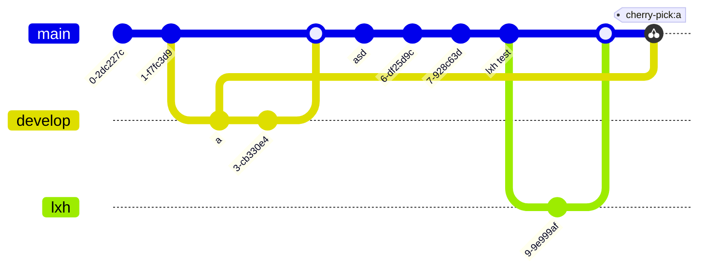

git learning 

https://learngitbranching.js.org/?locale=zh_CN

git checkout 

git rebase 

https://juejin.cn/post/7038093620628422669

HEAD 的相关理解

https://juejin.cn/post/6844903493078089736

查看分支是由谁创建的

https://segmentfault.com/q/1010000009314513

gitgraph

https://mermaid.js.org/syntax/gitgraph.html

