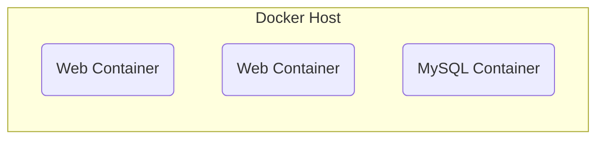
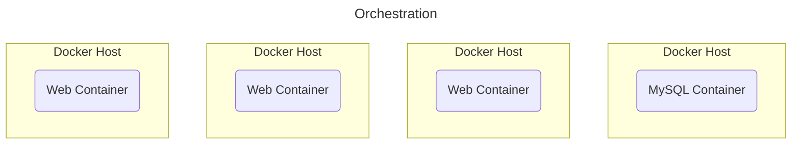
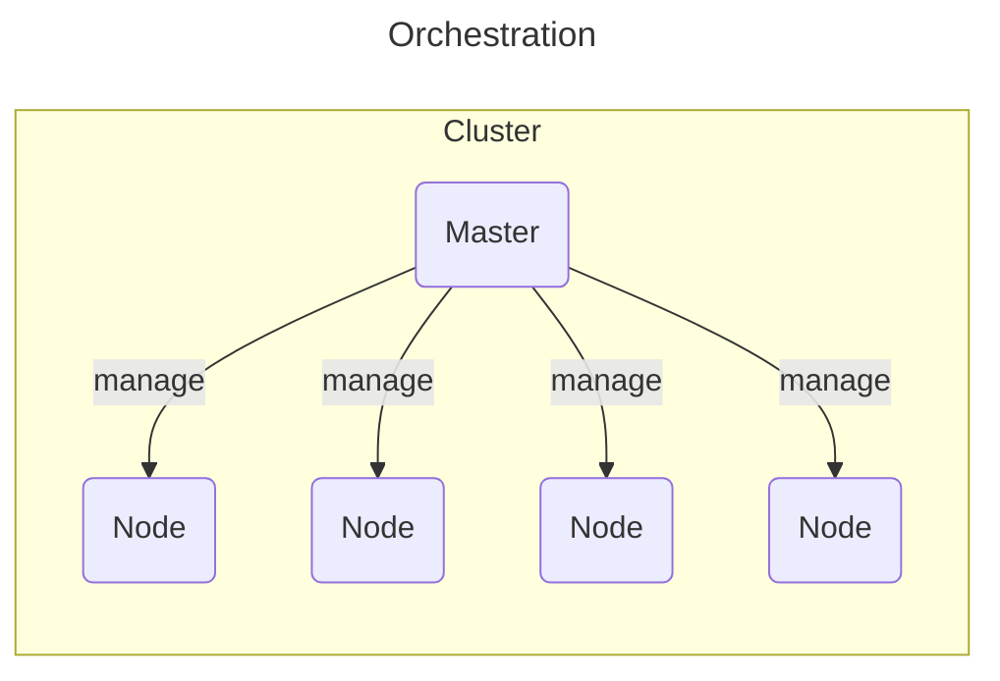
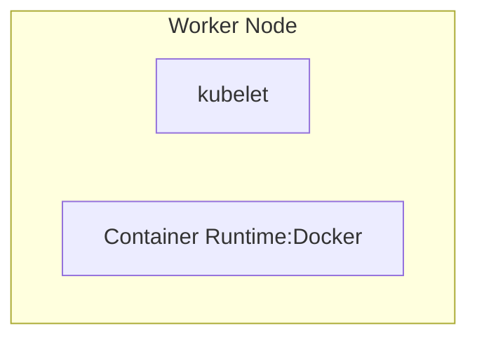
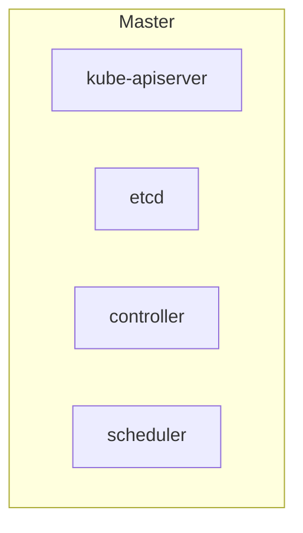
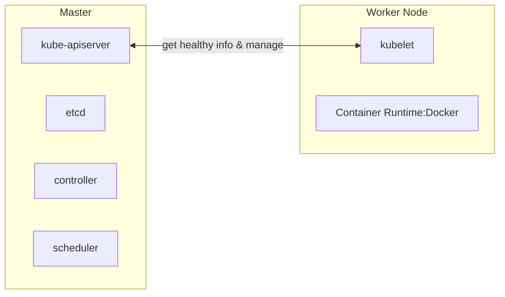
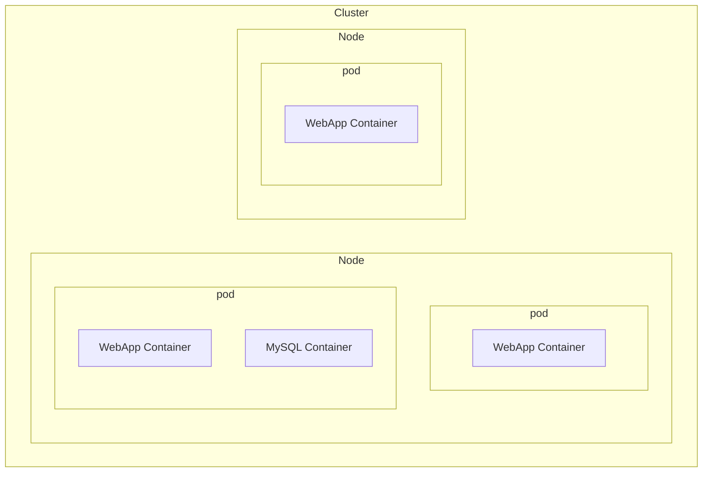
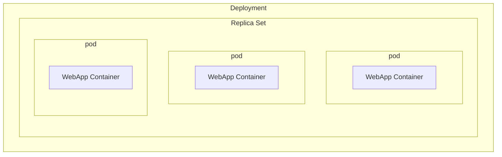
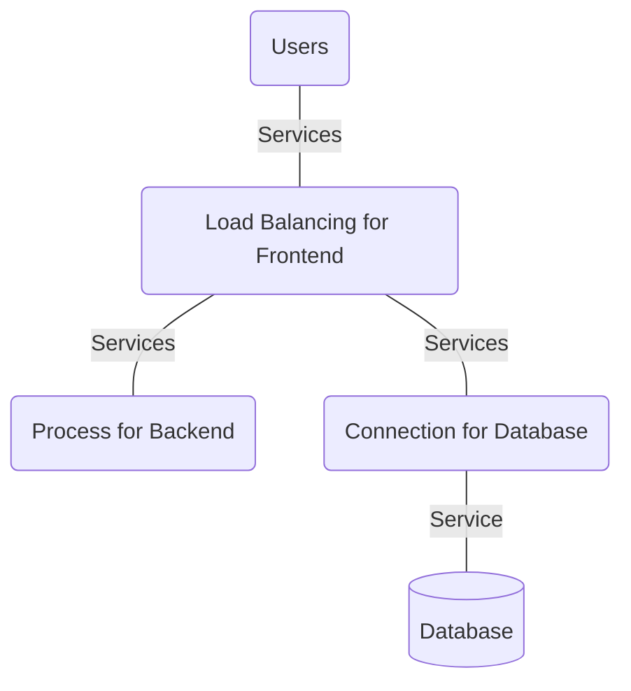
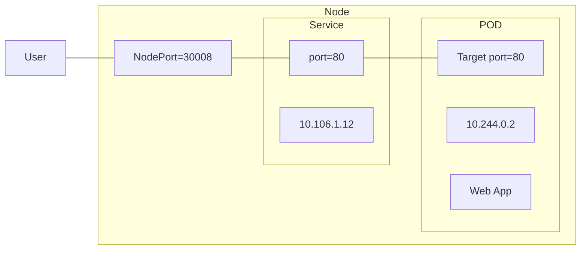

[TOC]

# Kubernetes Overview 


## Container Orchestration 



将应用程序打包到Docker容器中｡但接下来需要做什么？

如何在生产环境中运行它？

如果应用程序依赖于其他容器（如数据库､ 消息服务或其他后端服务）, 该怎么办？(如图)

如果用户数量增加, 需要扩展应用程序, 该怎么办？ 

当负载降低时, 您如何缩小规模？



平台需要协调容器之间的连接, 并根据负载自动向上或向下扩展｡自动部署和管理容器的整个过程称为容器编排｡Kubernetes只是一种容器编排技术｡ 还有其它编排技术

- Docker Swarm：很容易设置和入门, 但它缺乏复杂应用程序所需的一些高级功能｡
- kubernetes：最受欢迎, 但设置和开始有点困难, 它提供了大量定制部署的选项, 并支持复杂架构的部署｡
- MESOS：很难设置和开始使用, 但它支持许多高级功能｡


## Kubernetes Architecture




### Node(Minion)

node  是指集群中的一个物理或虚拟机器，用于运行容器化应用程序。每个节点都是集群的一部分，它承担了实际运行容器以及提供计算和存储资源的任务。一个 Kubernetes 集群通常包括多个节点，每个节点都可以运行一个或多个容器。这些节点通过网络相互通信，并由集群的控制平面进行管理和协调。在 Kubernetes 中，节点是集群的基本构建块之一，用于分配和管理容器化应用程序。Kubernetes 控制平面通过与节点上的组件进行通信，实现了应用程序的自动化部署、水平扩展、滚动更新等功能



### Cluster 

"cluster" 指的是 Kubernetes 集群，它是由多个物理或虚拟机器（节点）组成的系统，用于部署、管理和运行容器化应用程序。Kubernetes 提供了一个强大的平台，用于自动化应用程序的部署、伸缩、升级和维护，同时保证高可用性和资源的有效利用.集群通过 Master 和 Nodes 之间的通信协调和管理应用程序的生命周期。Master 控制平面管理整个集群的状态，包括调度、资源分配、故障恢复和水平扩展等操作。 Nodes 上运行 Kubelet 进程监控并执行 Master 的指令，以确保容器按照预期运行


### Master

"master" 是控制平面的一部分，是用于管理整个集群的核心组件集合。Master 控制平面负责决策和协调集群中的操作，包括应用程序的部署、调度、伸缩、升级和监控等。 Master 共同协作，确保集群中的容器化应用程序按照用户定义的规则运行。Master 控制平面通常运行在独立的服务器或虚拟机上，这些服务器不运行实际的应用程序容器。相反，它们负责监控和管理整个集群，保证应用程序的高可用性、可伸缩性和弹性。需要注意的是，Kubernetes 的 Master 和 Node（工作节点）之间的通信是至关重要的，它们共同协作来实现应用程序的自动化管理和部署。




### Components 




### kubectl 

```bash
# run一个app
kubectl run web-app

# 查看集群信息
kubectl cluster-info

# 列出集群中的所有节点
kubectl get nodes
```


## Kubernetes Concepts 



### Pods

"Pod" 是最小的调度单元，用于承载一个或多个容器。Pod 提供了一种逻辑上紧密耦合的容器组合，这些容器可以共享相同的网络命名空间、存储卷和其他资源。Pod 在逻辑上被视为一个单独的应用程序实例。

- 容器被封装到pod当中
- pod是应用程序的单个实例
- 在k8s中创建的最小对象

一个 Pod 可以包含一个或多个容器（通常是不同种类的container），这些容器通常共享相同的上下文和数据，以实现紧密协作。

Pod 内的容器可以通过 `localhost` 进行通信，无需通过网络。Pod 通常用于容器化应用程序的部署单元，其中多个容器需要紧密协同工作。


```bash
# 创建一个app并部署Nginx docker的实例
kubectl run nginx --image nginx 

# 查看cluster中的pod信息
kubectl get pods


```


**Pods with YAML** 

```yaml
# pod-definition.yml
apiVersion: v1
kind: Pod
metadata: 
	name: myapp-pod
	labels：
		app: myapp
		type: front-end
spec:
	containers:
		- name: nginx-container
		  image: nginx
```

- config file must have apiVersion, kind, metadata and spec. Those are top level or root level property.

```bash
kubectl create -f pod-definition.yml
kubectl apply -f pod-definition.yml

kubectl get pods 

kubectl describe pod myapp-pod
```


**-f, --filename**: 告诉`kubectl`命令要从名为`pod-definition.yml`的文件中读取资源配置信息，然后根据这些信息创建一个或多个Pod


### Replication Controllers and Replica Sets


**Replication Controller（复制控制器）**是 Kubernetes 中的一个资源对象，用于确保在集群中运行指定数量的 Pod 副本。它是 Kubernetes 最早引入的一种控制器，**后来逐渐被 ReplicaSets 和 Deployments 所取代，但仍然在一些场景中被使用**。

Replication Controller 通过不断监控集群中的 Pod 数量，可以保证以下特点：

- High Availability: 如果因为某个原因，某个 Pod 因为节点故障或其他原因被删除，Replication Controller 将会自动创建一个新的 Pod 来替代，以保持副本数量稳定或确保所指定的副本数目一致。
- Load Balancing & Scaling：用户数量增加时, 部署额外的POD来平衡两个POD之间的负载｡也就是说可以在需要时自动进行扩展或缩减POD数量。如果一个node的资源耗尽，可以跨cluster中的node来部署pod。

```yaml
# rc-definition.yml 
apiVersion: v1
kind: ReplicationController
metadata: 
	name: myapp-rc
	labels：
		app: myapp
		type: front-end
spec:
	template:
        metadata: 
        	name: myapp-pod
        	labels：
            	app: myapp
            	type: front-end
    	spec:
        	containers:
            - name: nginx-container
              image: nginx
	replicas: 3
```

template 是pod-definition.yml。因为要制作一个模板当pod出现故障或其它时要创建怎样的pod。

```bash
# 创建replicationcontroller
kubectl create -f rc-definition.yml

# 查看已创建的复制控制器的列表,
kubectl get replicationcontroller
```


replication-controller和replica-set的主要区别就是selector。replica-set需要selector。对于relication-contoller来说，selector不是必选。

ReplicaSet的`selector`字段用于定义ReplicaSet要管理的Pod副本的标签选择条件，确保ReplicaSet能够控制和维护符合特定选择条件的Pod数量。因为可能会存在很多个pod，pod的label不一样。

```yaml
# replicatset-definition.yml 
apiVersion: v1
kind: ReplicaSet
metadata: 
	name: myapp-replicaset
	labels：
		app: myapp
		type: front-end
spec:
	template:
        metadata: 
        	name: myapp-pod
        	labels：
            	app: myapp
            	type: front-end
    	spec:
        	containers:
            - name: nginx-container
              image: nginx
	replicas: 3
	selector:
		matchLabels:
			type: front-end
```


```bash
# 创建replicaset
kubectl create -f replicatset-definition.yml 

# 查看已创建的replicaset的列表
kubectl get replicaset 

# 查看replicaset的info
kubectl describe replicaset
```


**Scale** 

如何在已经创建好的yaml文件后更新replicas数量

```bash
# way1
## 更新replicaset-definition.yml
kubectl replace -f replicaset-definition.yml

# way2 
## 使用命令, 这不会更改配置文件中的数据
kubectl scale --replicas=6 -f replicaset-definition.yml
kubectl scale --replicas=6 replicaset myapp-replicaset
#                            [type]       [name]

# 删除replicaset
kubectl delete replicaset mapp-replicaset
```


### Deployements

如何在生产环境中部署的web服务器?

如何部署多个web服务器？

每当Docker更新新版本后如何更新docker实例?

- 如何更新部分实例？（全部更新会影响用户访问应用程序）这称为滚动更新 rolling update
- 如果执行的某个升级导致了意外错误, 并且系统要求撤消最近的更改,如何回滚最近执行的更改｡
- 如何对环境进行变更。例如升级基础Web Server版本､ 调整环境规模, 以及修改资源配置等｡在此情况下，不希望在运行命令后立即应用每个更改, 而是希望对环境应用暂停｡进行更改, 然后继续, 以便所有更改一起推出｡




```yaml
# deployment-definition.yml 
apiVersion: v1
kind: Deployment
metadata: 
	name: myapp-deployment
	labels：
		app: myapp
		type: front-end
spec:
	template:
        metadata: 
        	name: myapp-pod
        	labels：
            	app: myapp
            	type: front-end
    	spec:
        	containers:
            - name: nginx-container
              image: nginx
	replicas: 3
	selector:
		matchLabels:
			type: front-end
```

```bash
# 创建 deployment
kubectl create -f deployment-definition.yml 

# 查看已创建的deployment的列表
kubectl get deployments 

kubectl get all
```


#### Update and Rollback


Recreate Strategy： 关闭所有的应用程序，此时应用程序关闭无法访问。不好，非默认

Rolling Update： 关闭一个重启一个。好。默认. 具体的说，在旧replicaset中关闭一个pod，在新replicaset中创建一个新的pod，直至旧的完全关闭。

```bash
# 创建 deployment
kubectl create -f deployment-definition.yml 

# 查看已创建的deployment的列表
kubectl get deployments 

# 进行更新
kubectl apply -f deployment-definition.yml

# 查看状态
kubectl rollout status deployement/myapp-deployment
kubectl rollout history deployement/myapp-deployment

# rollback
kubectl rollout undo deployment/myapp-deployement
```


## Networking


## Services 



Kubernetes Service（Kubernetes 服务）是用于提供稳定网络连接和访问方式的资源对象。它允许将一组后端 Pod（或其他服务）公开给集群内或集群外的其他组件，而无需暴露每个 Pod 的 IP 地址。Service 为这些 Pod 提供了一个统一的入口点，使得其他应用或服务可以通过 Service 名称来访问它们，而不必直接知道 Pod 的 IP 地址。

Kubernetes Service 主要用于以下几个目的：

- 负载均衡： Service 可以为一组具有相同标签的 Pod 提供负载均衡。当多个 Pod 提供相同的服务时，Service 会自动分配流量到这些 Pod 上，从而实现负载均衡。

- 稳定的入口点： Pod 可能会因为扩展、收缩、故障等原因而变化，但 Service 的 IP 地址和 DNS 名称保持稳定。这使得客户端可以始终通过 Service 来访问后端服务，而不必担心 Pod 的变化。

- 内部和外部访问： 根据 Service 的类型，你可以将其配置为内部访问或外部访问。内部 Service 仅在集群内部可用，而外部 Service 可以通过集群外部的负载均衡器或 NodePort 方式提供访问。

- 服务发现： Service 通过 DNS 名称（通常是 servicename.namespace.svc.cluster.local）可用于服务发现。这使得其他应用程序和服务可以轻松地找到并连接到所需的服务。

Kubernetes 提供了不同类型的 Service，包括 ClusterIP、NodePort、LoadBalancer 和 ExternalName。每种类型都有不同的用例和配置方式，以满足不同的需求。

综上所述，Kubernetes Service 是一种在集群内部和外部提供稳定网络连接和访问方式的机制，使得在动态的 Pod 环境中保持服务的可靠性和可访问性变得更加容易。


#### NodePort



NodePort 是 Kubernetes 中一种 Service 类型，用于将某个 Service 公开到集群节点的特定端口上，以便外部网络可以访问该 Service。通过 NodePort，可以在每个节点上监听相同的端口，并将流量转发到 Service 中的后端 Pod。 Service就像是节点内部的虚拟服务器，在集群内部拥有自己的IP地址，这个地址叫做clusterIP

- Target port：this is where servers forward 
- Port: port on the service itself
- Nodeport: 在节点node上有一个port，用于从外部访问web服务器。
	- range: 30000-32767


```yaml
# service-definition.yml 
apiVersion: v1
kind: Service
metadata: 
	name: myapp-service
	labels：
		app: myapp
spec:
	type: NodePort
	ports:
	   # 如果不提供targetport则默认与port相同
	 - targetPort: 80 
	   port: 80
	   # 不提供nodeport则自动随机分配在范围内的port
	   nodePort: 30008
    selector:
        app: myapp
        type: front-end
```

selector用于筛选特定的服务，比如，可能有数百个port，从这数百个port中筛选出运行myapp的服务。

```bash
# 创建 service
kubectl create -f service-definition.yml 

# 查看已创建的deployment的列表
kubectl get services 
```

多个Pod情况下，为了实现高可用性和负载平衡。使用了Random SessionAffinity Algorithm来平衡多个port的负载


## Microservices Architecture


## Kubernetes on Cloud


